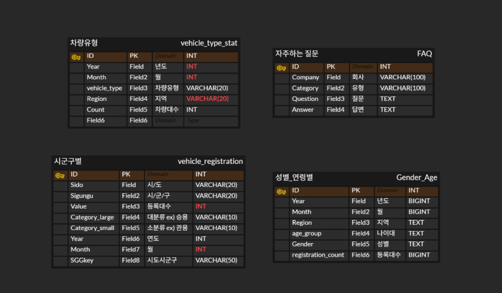

# SKN16-1st-2Team
SKN 16기 1차 단위프로젝트

 

# 📌 프로젝트 소개
전국 <strong>자동차의 등록 현황</strong>을 시각적으로 분석하고 
기아,현대,제네시스의 <strong>FAQ을 streamlit을 통해 제공</strong>하는 시스템 구현

# 🫂 팀 소개
| 이름        | 역할 |
|-------------|------|
| 조장_이광식 | 데이터베이스 구축 담당, 전체적인 방향성 설계 |
| 조원_이용채 | Streamlit 코드 작성, 지도 시각화 담당 |
| 조원_박태규 | 다양한 유형의 그래프 제작, 발표 담당 |
| 조원_강동기 | 제네시스 FAQ 크롤링 및 처리 |
| 조원_김혜린 | 현대자동차 FAQ 크롤링 및 처리 |
| 조원_김민정 | 기아자동차 FAQ 크롤링 및 처리 |

# 🛠 기술 스택
- 
- 
- 
- 
- 
- 

# 📄 ERD

# 🔍 수집 데이터
본 프로젝트는 **대한민국 자동차 등록 현황과 자동차 브랜드별 FAQ 안내 시스템 구축**을 목표로, 다음과 같은 데이터를 수집하여 분석 및 시각화에 활용하였습니다.

---

### 1. 📊 월별 자동차 등록 현황 통계  
- **출처**: [국토교통부 통계누리](https://stat.molit.go.kr/)
- **수집 방법**: 국토교통부 통계누리에서 제공하는 월별 통계 자료 엑셀 파일 다운로드

#### 📍 데이터 출처 및 범위
- **수집 데이터 기간**: 2022년 1월 ~ 2025년 5월  
- **데이터 규모**: 약 12,000여 개의 데이터  
- **지역적 범위**: 전국

#### 📍 주요 변수
- 등록 일자  
- 등록 대수  
- 연령  
- 성별  
- 지역

#### 📍 데이터 설명
대한민국의 **자동차 등록 현황**을 분석하기 위한 기초 자료로,  
연도별·월별 등록된 자동차의 전체 수와 차종별 분포(승용차, 화물차, 특수차 등)를 포함합니다.  
이를 통해 **시기별 자동차 보급 추세**, **인구 특성별 등록 현황**,  
그리고 **지역별 자동차 이용 행태** 등을 분석할 수 있습니다.  
본 프로젝트에서는 이 데이터를 기반으로 자동차 관련 FAQ 정보와 함께  
**데이터 기반 안내 시스템** 구축에 활용하였습니다.

---

### 2. 🚗 현대자동차 홈페이지 FAQ 데이터  
- **출처**: [현대자동차 공식 웹사이트](https://www.hyundai.com/)
- **수집 방법**: Selenium 기반 크롤러 사용

#### 📍 데이터 설명
현대자동차 고객센터 FAQ 페이지에 게시된 자주 묻는 질문과 그에 대한 답변을 자동화 도구로 수집하였습니다.  
카테고리별로 분류되어 있으며, 고객들이 궁금해하는 내용을 데이터로 정리하였습니다.

---

### 3. 🚘 기아자동차 홈페이지 FAQ 데이터  
- **출처**: [기아 공식 웹사이트](https://www.kia.com/)
- **수집 방법**: Selenium 기반 크롤러 사용

#### 📍 데이터 설명
기아 고객센터의 FAQ 항목을 크롤링하여 질문과 답변 데이터를 수집하였습니다.  
현대자동차와 유사한 형식으로 구성되어 있어 브랜드 간 비교 분석이 가능합니다.

---

### 4. 🚙 제네시스 홈페이지 FAQ 데이터  
- **출처**: [제네시스 공식 웹사이트](https://www.genesis.com/)
- **수집 방법**: Selenium 기반 크롤러 사용

#### 📍 데이터 설명
제네시스 브랜드의 프리미엄 고객 FAQ 정보를 크롤링하여 수집하였습니다.  
고급 브랜드 특유의 서비스 응답 내용을 포함하고 있어 차별화된 고객 문의 데이터를 확보할 수 있었습니다.

---

> ℹ️ 모든 FAQ 데이터는 크롤링 후 CSV 파일로 정리되었으며,  
> `카테고리`, `질문`, `답변` 구조로 구성되어 있습니다.  
> 자동차 등록 현황 통계는 엑셀 → CSV로 변환하여 분석에 활용하였습니다.

 
 

# 💻 실제 화면
### 시군구별 자동차 등록대수 단계구분도 / 연령대별 등록 분포 / 시계열 차트 시각화
지역, 차종, 년월 선택 가능
DB 연동을 통해 조건에 맞는 데이터 추출하여 시각화

### 기업별 자동차 FAQ 안내 및 검색 기능 구현
현대자동차, 제네시스, 기아자동차 홈페이지의 FAQ 크롤링
카테고리로 구분하여 질문과 답변 표시
키워드로 검색하여 관련 질문과 답변을 회사별로 나타내는 기능 구현

